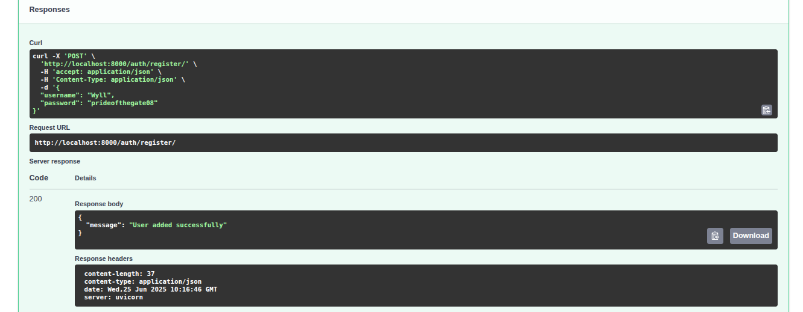
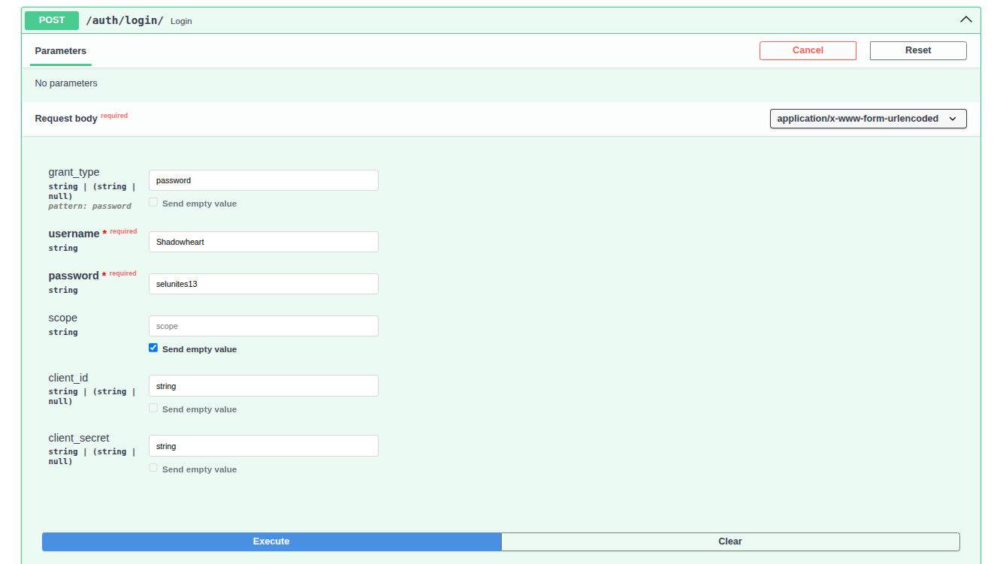
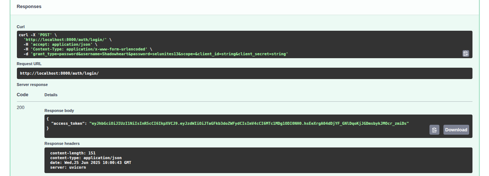
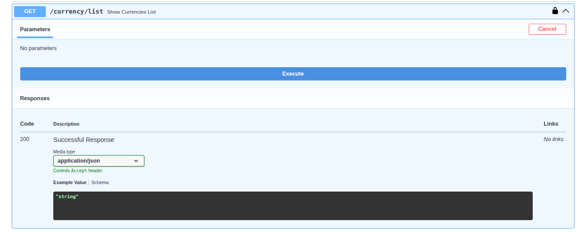
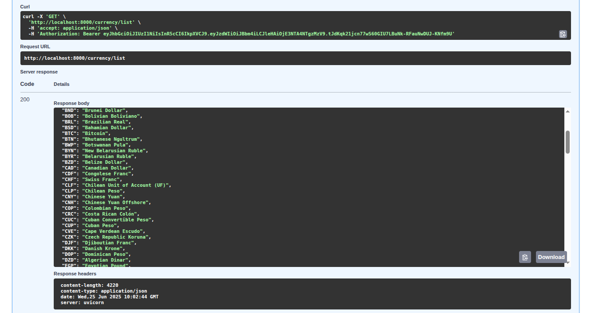
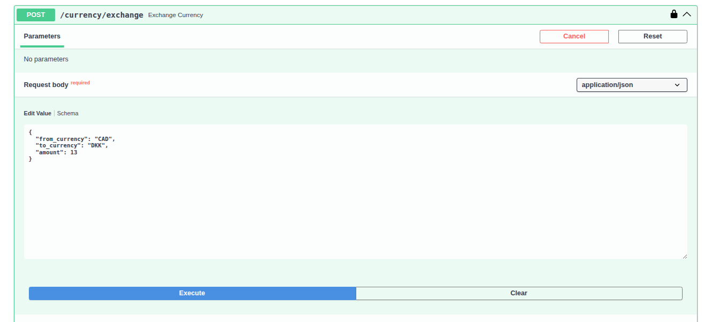
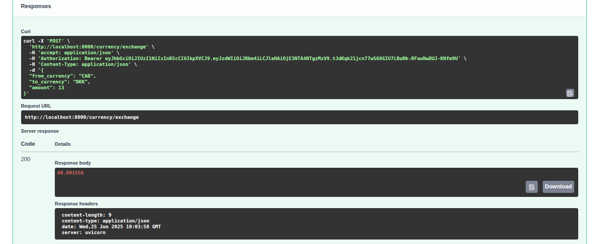

Currency Converter - a simple and easy to use REST API to check the latest global currency rates. It provides registered users with an access to the list of world currencies and allows them to convert from one currency to another. The project includes JWT authentication and integration with an external API for a real-time exchange.


## Features

  - register and login to check the list of all available currencies
  - quickly convert one currency to another using the most recent exchange rate data
  - the project is integrated with an external currency API ["Currency Data API"](https://apilayer.com/marketplace/currency_data-api) to provide the neccesary data

## Installation

This project is built using FastAPI as the main framework. Please refer to the pyproject.toml file for the full list of required dependencies.

1) Download the package from GitHub:

    ```bash
    git clone git@github.com:Mirrasol/Currency-Converter.git
    ```

2) Install using uv from your console:

    ```bash
    make install
    ```

    or set your own virtual environment using pip and other package managers.

3) Don't forget to create the '.env' file that contains your secret keys and database settings: 
 - Please refer to the '.env_example' file

 - Note: you can get the API_Key from the external forex API: ["Currency Data API"](https://apilayer.com/marketplace/currency_data-api)

4) Apply initial migration:

    ```bash
    alembic upgrade head
    ```

5) Run the project with a command:

    ```bash
    make run
    ```

    or with a Uvicorn directly:

    ```bash
    uvicorn main:app --reload
    ```

6) Alternatively, run the project with Docker and apply initial migration:

    ```bash
    docker compose -f docker-compose.yaml up -d
    ```
    ```bash
    docker compose exec web alembic upgrade head
    ```

Also check Makefile for the rest of the available commands.

## List of endpoints


## Swagger Demo Screens

- Registering a new user:


- Successful register response:



-  Login request:



- Login response:



- Getting the list of currencies:




- Checking the exchange:



